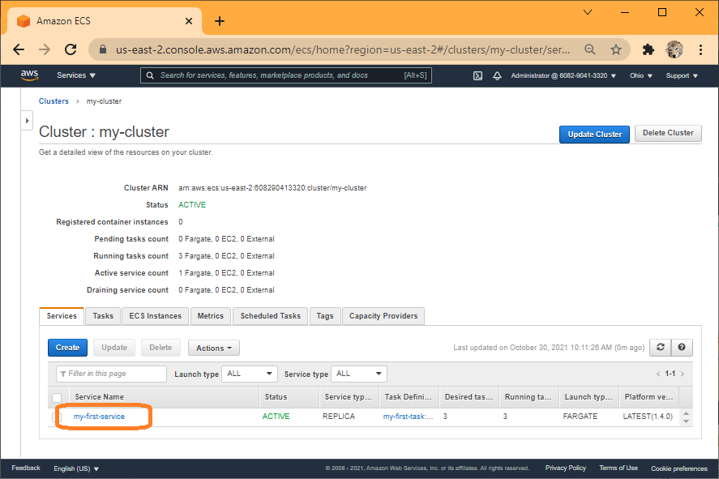
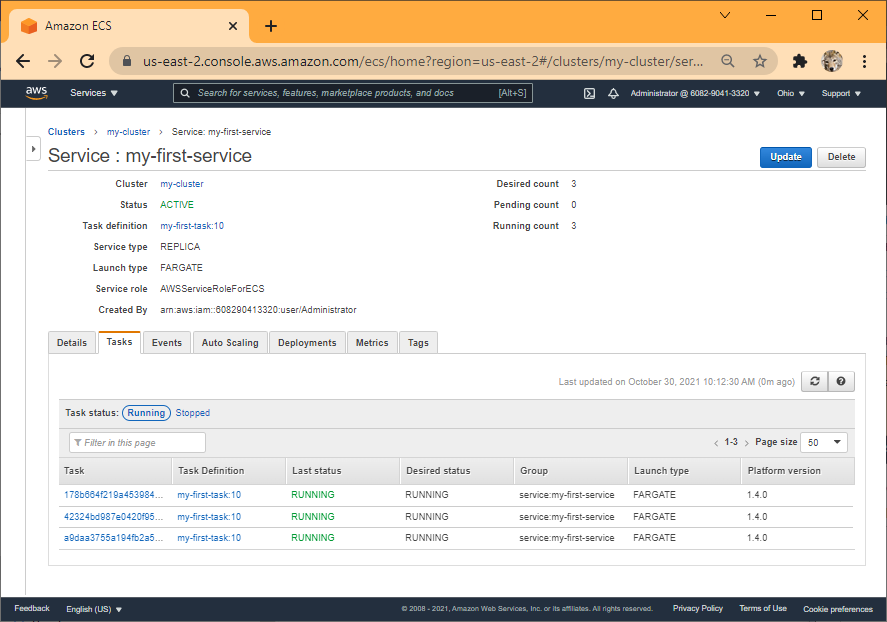
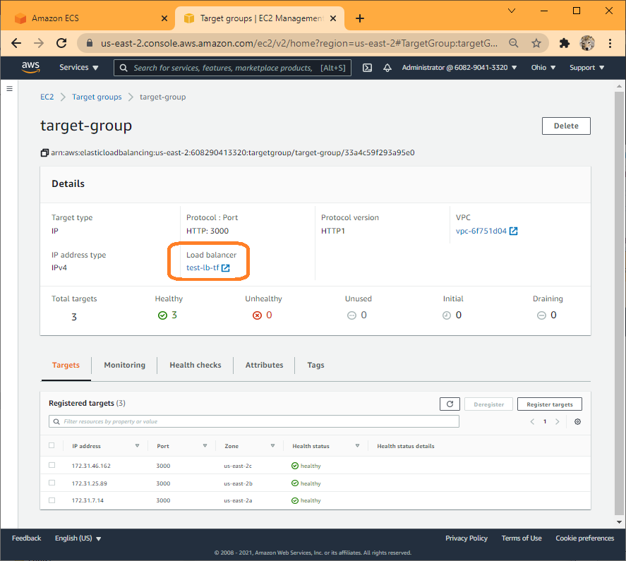
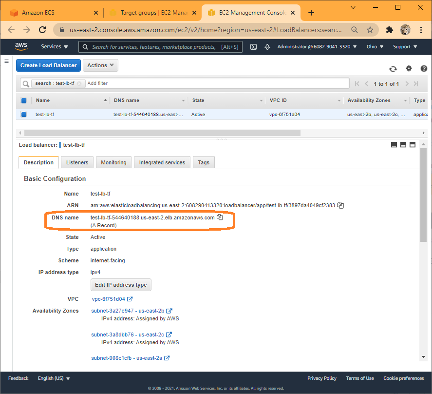
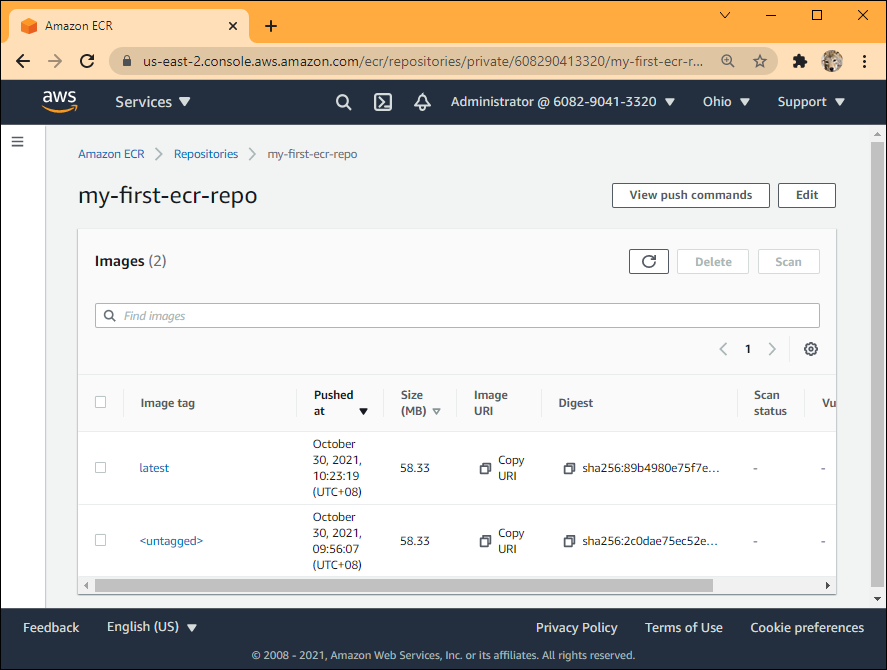

# Fundamentals in Developer Tools - Capstone Project

## Requirements:

-----------------------------------------------------------------------------------|--------------------------------------------------------------------------
Project Requirements                                                               | The amongus-todo app
-----------------------------------------------------------------------------------|--------------------------------------------------------------------------
Deploy a node.js application                                                       | The amongus-todo app
to a VM/server of a cloud provider of your choice.                                 | aws.amazon.com
The application will have some basic tests                                         | the application has tests/server.test.js
The application must be dockerized/containerised                                   | docker image is built as part of Github action
The project must include a CI/CD pipeline using a CI/CD tool of your choice        | Github action is used
The CI/CD pipeline must include Automated tests                                    | tests/server.test.js is executed as part of Github action
The CI/CD pipeline must include Automated Deployment to the cloud provider         | docker image is built and pushed to ams ecr as part of Github action
The VM/server and other infrastructural resources must be created using Terraform  | full set of infrastructure is build using terraform
Infra creation can be done by invoking Terraform commands locally                  | terraform is invoked locally.


## 1. Deploy the amongus-todo Application

This refers to the code contained in the repository https://github.com/stanleynguyen/amongus-todo.  In order
not to run into additional confusions, I copied the code and create this separate repository instead of performing a fork. 
You may refer to the original repository for original `README.me` and other documentation.

## 2. AWS selected as the cloud provider

AWS was selected for this project due to earlier involvement and experiences.

## 3. Application has some basic tests

The application has `tests/server.test.js`.  This is used for as basic test.

## 4. Dockerized/containerised the Application

`Dockerfile` was created.  This is referenced during the CI/CD process to build a docker iamge of the app.  The docker image has
start up commands embedded to make it executable and thus containerised.

## 5. CI/CD Pipeline over Github Action

Github action is used for CI/CD.  This is achieved by having the file `.github/workflows/cicd.yml`.

   
## 6. CI/CD Pipeline inclides Automated test

`.github/workflows/cicd.yml` includes `run: npm test`, and the subsequent build step `needs: run-test`:

```yml
jobs:
  run-test:
    runs-on: ubuntu-latest
    steps:
...
      - name: Run tests
        run: npm test

  build-push:
    runs-on: ubuntu-latest
    needs: run-test
```

## 7. CI/CD pipeline include Automated Deployment

`.github/workflows/cicd.yml` includes steps to build and push docker image to AWS ECR:

```yml
  build-push:
    runs-on: ubuntu-latest
    needs: run-test
    steps:
...
    - name: Build, tag, and push image to Amazon ECR
      env:
        ECR_REGISTRY: ${{ steps.login-ecr.outputs.registry }}
        ECR_REPOSITORY: my-first-ecr-repo
        IMAGE_TAG: latest
      run: |
        docker build -t $ECR_REGISTRY/$ECR_REPOSITORY:$IMAGE_TAG .
        docker push $ECR_REGISTRY/$ECR_REPOSITORY:$IMAGE_TAG
```

## 8. VM/server infrastructural resources created using Terraform

Two versions of .tf files were created:

- `ecr.tf.txt`: This version of `.tf` creates only one component: an aws ecr repository by the name `my_first_ecr_repo`.  Once this is created, the Github workflow can be executed to build and
  push docker images of the app to this repository by the tag `latest`'.
- `main.tf.txt`: This version of `.tf` has the same aws ecr repository by the name `my_first_ecr_repo`, plus another 14 components to set up the infrastructure to host the app.

# 9. Manual Local invokation of terraform infra creation

## 1. Terraform to create ecr

Use `cp ecr.tf.txt infra.tf`, followed by `terraform apply` to create aws ecr:

```bash
deng@LSOASUS2019:~$ cd /mnt/c/Users/deng/DTCapstone/terraform/aws
deng@LSOASUS2019:/mnt/c/Users/deng/DTCapstone/terraform/aws$ terraform apply

Terraform used the selected providers to generate the following execution plan. Resource actions are indicated with the
following symbols:
  + create

Terraform will perform the following actions:

  # aws_ecr_repository.my_first_ecr_repo will be created
  + resource "aws_ecr_repository" "my_first_ecr_repo" {
      + arn                  = (known after apply)
      + id                   = (known after apply)
      + image_tag_mutability = "MUTABLE"
      + name                 = "my-first-ecr-repo"
      + registry_id          = (known after apply)
      + repository_url       = (known after apply)
    }

Plan: 1 to add, 0 to change, 0 to destroy.
╷
│ Warning: Version constraints inside provider configuration blocks are deprecated
│
│   on infra.tf line 2, in provider "aws":
│    2:   version = "~> 2.0"
│
│ Terraform 0.13 and earlier allowed provider version constraints inside the provider configuration block, but that is
│ now deprecated and will be removed in a future version of Terraform. To silence this warning, move the provider
│ version constraint into the required_providers block.
╵

Do you want to perform these actions?
  Terraform will perform the actions described above.
  Only 'yes' will be accepted to approve.

  Enter a value: yes

aws_ecr_repository.my_first_ecr_repo: Creating...
aws_ecr_repository.my_first_ecr_repo: Creation complete after 3s [id=my-first-ecr-repo]

Apply complete! Resources: 1 added, 0 changed, 0 destroyed.
deng@LSOASUS2019:/mnt/c/Users/deng/DTCapstone/terraform/aws$
```


## 2. Github action for CI/CD

Invoke Github CI/CD by making and pushing changes in the github app repository.

Workflow executed successfully:


App dockerized image created and pushed to ecr taggd latest:


## 3. Terraform to create the rest of infra

Use `cp main.tf.txt infra.tf`, followed by `terraform apply` to create the remaining part of the full infrastructure.

```bash
deng@LSOASUS2019:/mnt/c/Users/deng/DTCapstone/terraform/aws$ terraform apply
aws_ecr_repository.my_first_ecr_repo: Refreshing state... [id=my-first-ecr-repo]

Note: Objects have changed outside of Terraform

Terraform detected the following changes made outside of Terraform since the last "terraform apply":

  # aws_ecr_repository.my_first_ecr_repo has been changed
  ~ resource "aws_ecr_repository" "my_first_ecr_repo" {
        id                   = "my-first-ecr-repo"
        name                 = "my-first-ecr-repo"
      + tags                 = {}
        # (4 unchanged attributes hidden)

        # (1 unchanged block hidden)
    }

Unless you have made equivalent changes to your configuration, or ignored the relevant attributes using ignore_changes,
the following plan may include actions to undo or respond to these changes.

───────────────────────────────────────────────────────────────────────────────────────────────────────────────────────

Terraform used the selected providers to generate the following execution plan. Resource actions are indicated with the
following symbols:
  + create

Terraform will perform the following actions:

  # aws_alb.application_load_balancer will be created
  + resource "aws_alb" "application_load_balancer" {
...
    }

Plan: 14 to add, 0 to change, 0 to destroy.

Do you want to perform these actions?
  Terraform will perform the actions described above.
  Only 'yes' will be accepted to approve.

  Enter a value: yes

aws_default_subnet.default_subnet_b: Creating...
...
aws_ecs_service.my_first_service: Creation complete after 3s [id=arn:aws:ecs:us-east-2:608290413320:service/my-cluster/my-first-service]

Apply complete! Resources: 14 added, 0 changed, 0 destroyed.
deng@LSOASUS2019:/mnt/c/Users/deng/DTCapstone/terraform/aws$
```

ECS Cluster created


Cluster details


Service details


Tasks in Service


Target group


Target group details


Load balancer, the URL to access the app can be found under `DNS nmae`:


App front page (test-lb-tf-145880904.us-east-2.elb.amazonaws.com):


App todos page (http://test-lb-tf-145880904.us-east-2.elb.amazonaws.com/todos):


## 4. Modify the app and CI/CD

Modify the app by adding ` (more text)` to "text" of the first record in `db.json`, and the change is pushed to github.

```
{
  "todos": [
    {
      "id": 1,
      "text": "Align Engine Output (more text)",
      "type": "long"
    },

```

Workflow executed successfully:


ECR has an updated image


## 5. Deploy new image

Updated app image is not auto deployed.  To deploy the new image, terraformed is invoked locally to first tear down the infrastruture, and then recreate.

Use `cp ecr.tf.txt infra.tf`, followed by `terraform apply` to tear down the infra leaving only the ecr.

Use `cp main.tf.txt infra.tf`, followed by `terraform apply` to re-create the full infrastructure.

App todos page (http://test-lb-tf-923086891.us-east-2.elb.amazonaws.com/todos) reflects changes deployed:


## References

Many blog posts were consulted and tried when working on this project.

On using Github workflow to building and testing nodesjs: https://docs.github.com/en/actions/automating-builds-and-tests/building-and-testing-nodejs-or-python

On building and pushing image to ecr: https://towardsaws.com/build-push-docker-image-to-aws-ecr-using-github-actions-8396888a8f9e

On using terraform to create ecr in aws: https://registry.terraform.io/providers/hashicorp/aws/latest/docs/resources/ecr_repository

On aws ecr push and ecs deploy: https://github.com/marketplace/actions/ecr-push-and-ecs-deploy

A youtube clip om creating aws cluster, which will create an ec2 instance, then in the cluster create a task, task has a related container and image 
(which has been pushed to a ecr earlier on), some port mapping, security policy allow incoming traffic; go to cluster and run the task. https://www.youtube.com/watch?v=zs3tyVgiBQQ

On using terraform to create aws cluster: https://registry.terraform.io/providers/hashicorp/aws/latest/docs/resources/ecs_cluster

On deploying an AWS ECS Cluster of EC2 Instances With Terraform: https://medium.com/swlh/creating-an-aws-ecs-cluster-of-ec2-instances-with-terraform-85a10b5cfbe3

On creating AWS ECS cluster and deploying a nodejs application: https://dev.to/thnery/create-an-aws-ecs-cluster-using-terraform-g80

The most relevant post that covers this project: https://medium.com/avmconsulting-blog/how-to-deploy-a-dockerised-node-js-application-on-aws-ecs-with-terraform-3e6bceb48785

