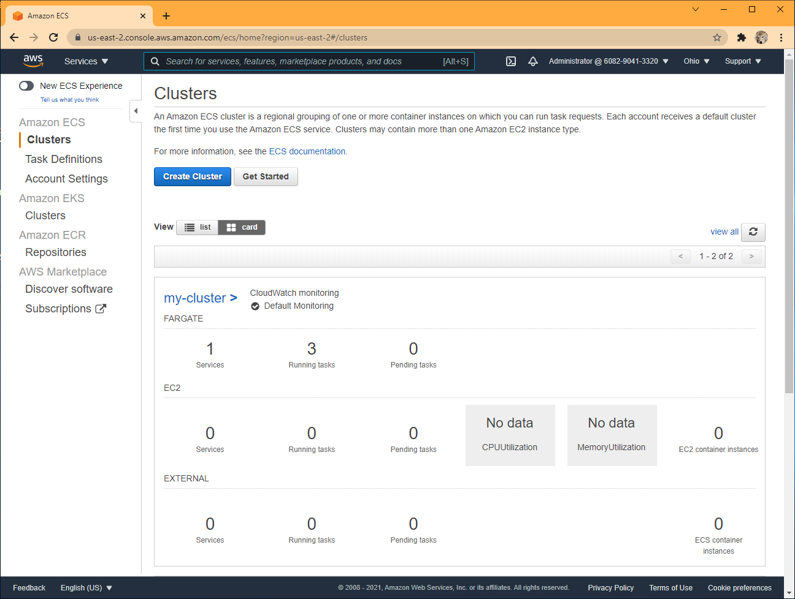
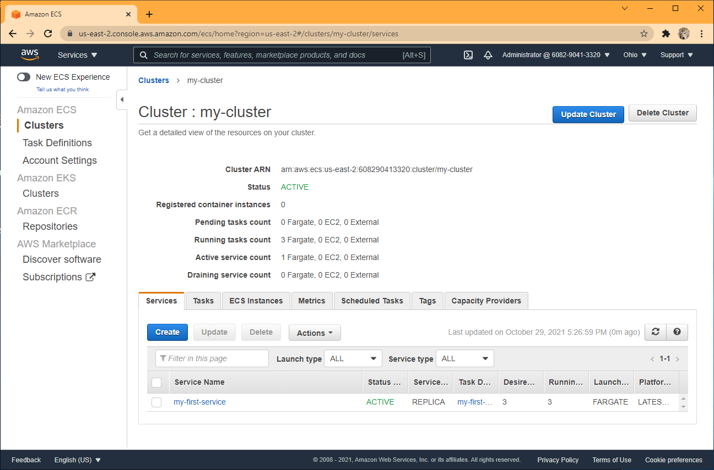
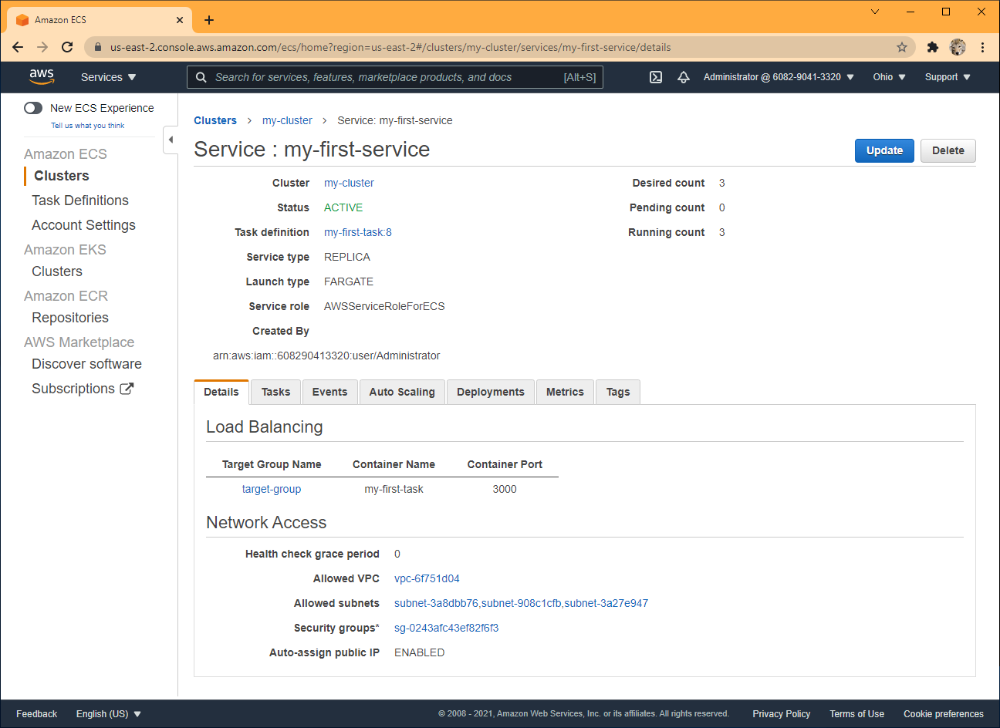
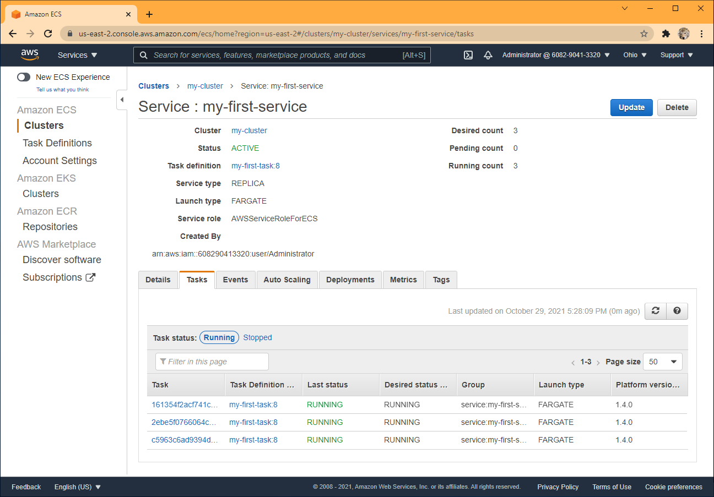
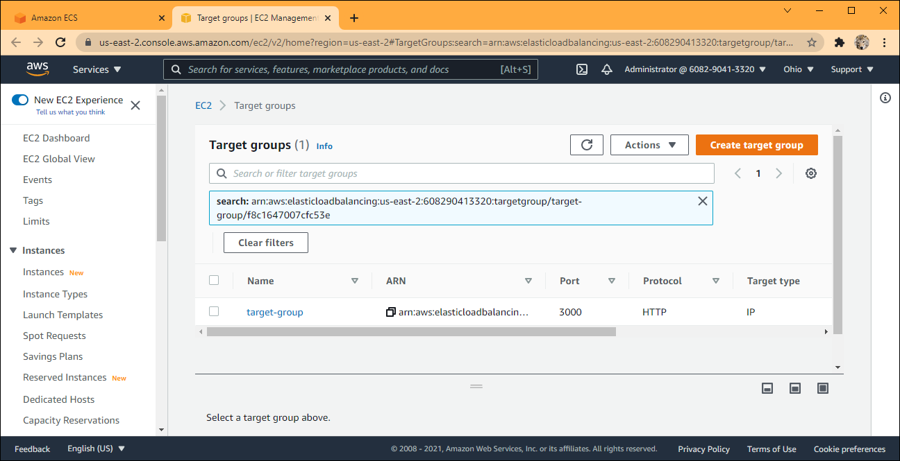
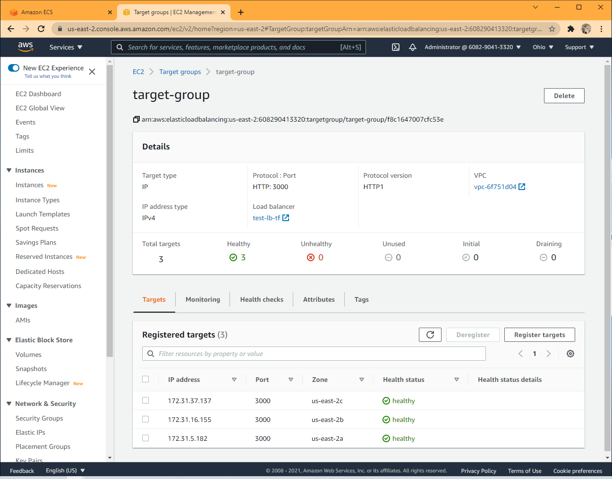
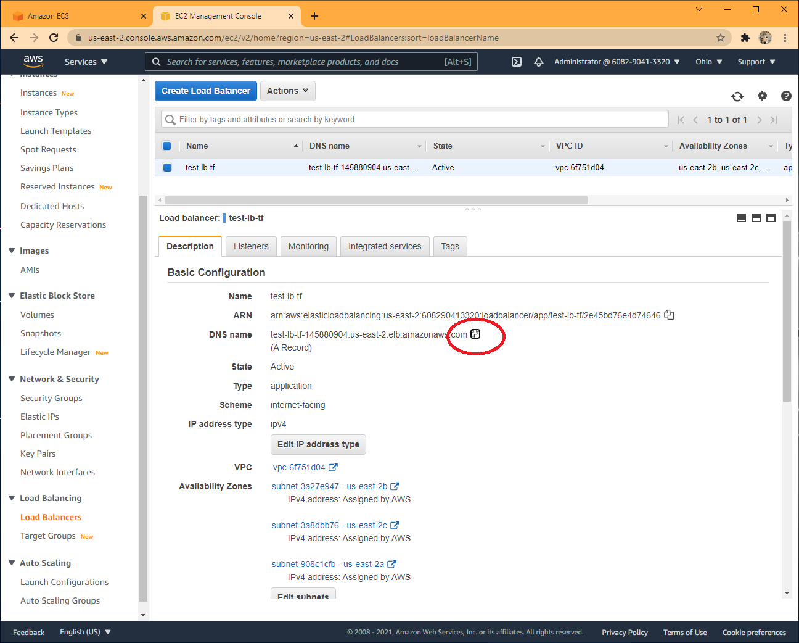
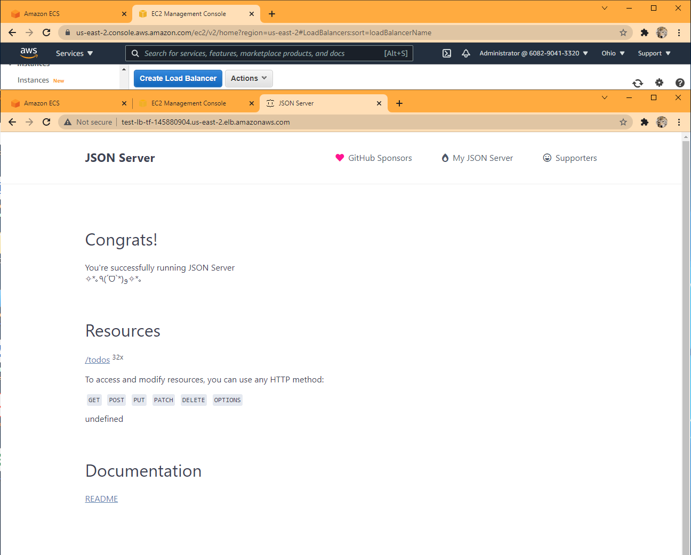
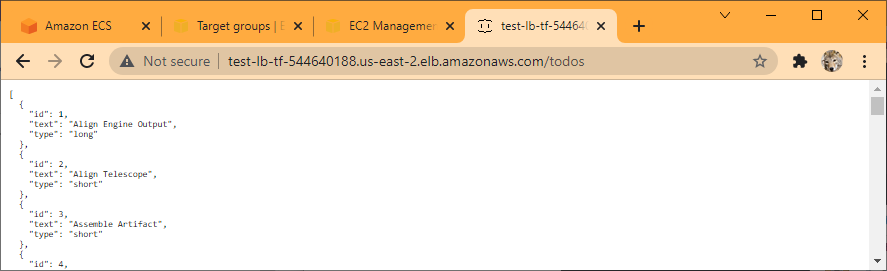

## Verify Successfull Application Deployment

Review the infrastructure.

ECS Cluster created:

Cluster details:

Service details:

Tasks in Service

Target group

Target group details

Load balancer, the URL to access the app can be found under `DNS nmae`:

App front page (test-lb-tf-145880904.us-east-2.elb.amazonaws.com):

App todos page (http://test-lb-tf-145880904.us-east-2.elb.amazonaws.com/todos):

