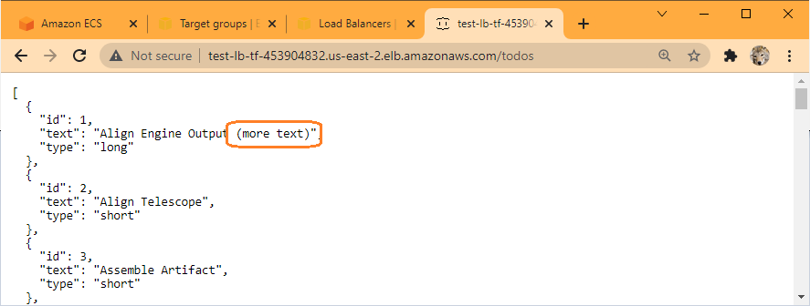

## Verify Successfull Application Change Deployment

When the infrastructure is teared down and recreated, the load balancer details changes:

Load balancer, the URL to access the app can be found under `DNS nmae`.  Do note that it is different from the previous one:

App todos page (http://test-lb-tf-453904832.us-east-2.elb.amazonaws.com/todos) reflects changes deployed:

