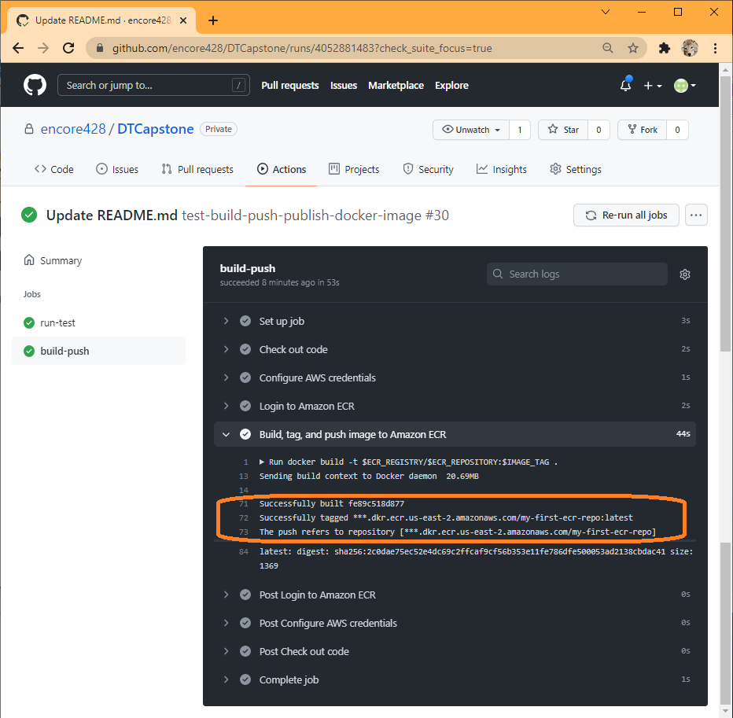
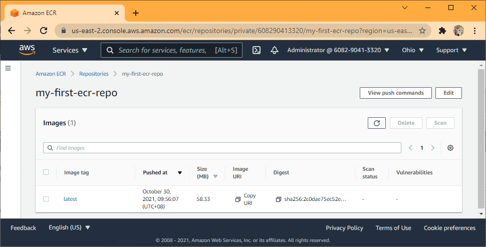

## Push application to Github

Invoke Github CI/CD by making and pushing changes in the github app repository.

Workflow executed successfully:

App dockerized image created and pushed to ecr tagged latest:

