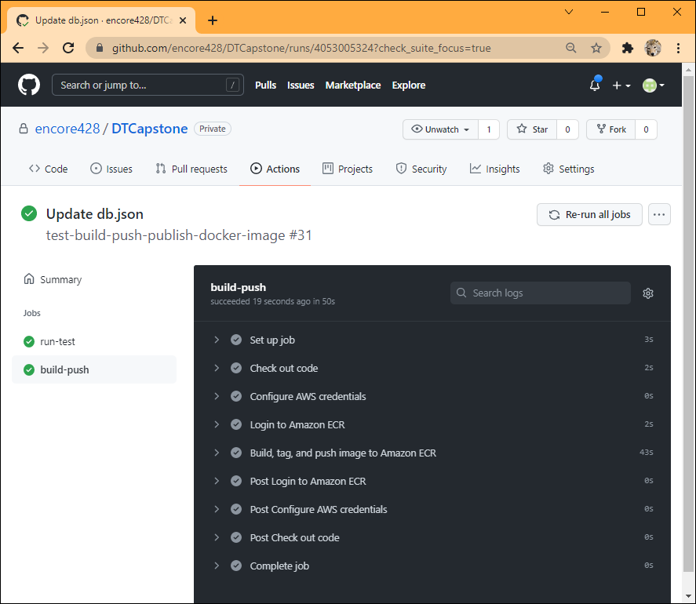
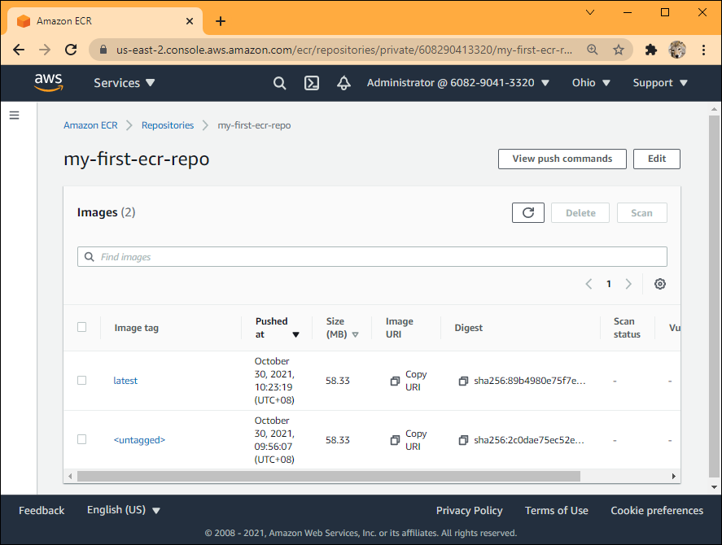

## Push Application Change to Github

Modify the app by adding ` (more text)` to "text" of the first record in `db.json`, and push the change to github.

```
{
  "todos": [
    {
      "id": 1,
      "text": "Align Engine Output (more text)",
      "type": "long"
    },

```

Workflow executed successfully:


ECR has an updated image


## 5. Deploy new image

Updated app image is not auto deployed to the executing instances.  To deploy the new image, terraform is invoked locally to first tear down the infrastruture, and then recreate.

Use `cp ecr.tf.txt infra.tf`, followed by `terraform apply` to tear down the infra leaving only the ecr.

Use `cp main.tf.txt infra.tf`, followed by `terraform apply` to re-create the full infrastructure.

App todos page (http://test-lb-tf-923086891.us-east-2.elb.amazonaws.com/todos) reflects changes deployed:


## 6. Complete Tear Down

Use  `terraform destroy` to tear down the entire infrastructure at AWS.

```
deng@LSOASUS2019:/mnt/c/Users/deng/DTCapstone/terraform/aws$ terraform destroy
aws_default_subnet.default_subnet_c: Refreshing state... [id=subnet-3a8dbb76]
...
    }

Plan: 0 to add, 0 to change, 15 to destroy.

Do you really want to destroy all resources?
  Terraform will destroy all your managed infrastructure, as shown above.
  There is no undo. Only 'yes' will be accepted to confirm.

  Enter a value: yes
  
aws_iam_role_policy_attachment.ecsTaskExecutionRole_policy: Destroying... [id=ecsTaskExecutionRole-20211029103418578800000002]
aws_ecs_service.my_first_service: Destroying... [id=arn:aws:ecs:us-east-2:608290413320:service/my-cluster/my-first-service]
aws_iam_role_policy_attachment.ecsTaskExecutionRole_policy: Destruction complete after 1s
aws_ecs_service.my_first_service: Still destroying... [id=arn:aws:ecs:us-east-2:608290413320:service/my-cluster/my-first-service, 10s elapsed]
aws_ecs_service.my_first_service: Still destroying... [id=arn:aws:ecs:us-east-2:608290413320:service/my-cluster/my-first-service, 20s elapsed]
...
aws_ecs_service.my_first_service: Still destroying... [id=arn:aws:ecs:us-east-2:608290413320:service/my-cluster/my-first-service, 6m10s elapsed]
aws_ecs_service.my_first_service: Still destroying... [id=arn:aws:ecs:us-east-2:608290413320:service/my-cluster/my-first-service, 6m20s elapsed]
aws_ecs_service.my_first_service: Destruction complete after 6m20s
aws_ecs_cluster.my_cluster: Destroying... [id=arn:aws:ecs:us-east-2:608290413320:cluster/my-cluster]
aws_ecs_task_definition.my_first_task: Destroying... [id=my-first-task]
aws_security_group.service_security_group: Destroying... [id=sg-0609f3ae1e001bb50]
aws_lb_listener.listener: Destroying... [id=arn:aws:elasticloadbalancing:us-east-2:608290413320:listener/app/test-lb-tf/3b9915b9ae30c32c/0924c7c832da8a1f]
aws_ecs_task_definition.my_first_task: Destruction complete after 1s
aws_ecr_repository.my_first_ecr_repo: Destroying... [id=my-first-ecr-repo]
aws_iam_role.ecsTaskExecutionRole: Destroying... [id=ecsTaskExecutionRole]
aws_lb_listener.listener: Destruction complete after 1s
aws_lb_target_group.target_group: Destroying... [id=arn:aws:elasticloadbalancing:us-east-2:608290413320:targetgroup/target-group/2e5c8e54f73e8117]
aws_alb.application_load_balancer: Destroying... [id=arn:aws:elasticloadbalancing:us-east-2:608290413320:loadbalancer/app/test-lb-tf/3b9915b9ae30c32c]
aws_ecs_cluster.my_cluster: Destruction complete after 2s
aws_lb_target_group.target_group: Destruction complete after 2s
aws_default_vpc.default_vpc: Destroying... [id=vpc-6f751d04]
aws_default_vpc.default_vpc: Destruction complete after 0s
aws_security_group.service_security_group: Destruction complete after 3s
aws_ecr_repository.my_first_ecr_repo: Destruction complete after 3s
aws_iam_role.ecsTaskExecutionRole: Destruction complete after 3s
aws_alb.application_load_balancer: Destruction complete after 5s
aws_default_subnet.default_subnet_c: Destroying... [id=subnet-3a8dbb76]
aws_default_subnet.default_subnet_b: Destroying... [id=subnet-3a27e947]
aws_default_subnet.default_subnet_a: Destroying... [id=subnet-908c1cfb]
aws_security_group.load_balancer_security_group: Destroying... [id=sg-069e6225916b71959]
aws_default_subnet.default_subnet_b: Destruction complete after 0s
aws_default_subnet.default_subnet_c: Destruction complete after 0s
aws_default_subnet.default_subnet_a: Destruction complete after 0s
aws_security_group.load_balancer_security_group: Still destroying... [id=sg-069e6225916b71959, 10s elapsed]
aws_security_group.load_balancer_security_group: Still destroying... [id=sg-069e6225916b71959, 20s elapsed]
aws_security_group.load_balancer_security_group: Destruction complete after 25s

Destroy complete! Resources: 15 destroyed.
deng@LSOASUS2019:/mnt/c/Users/deng/DTCapstone/terraform/aws$
```


# References

Many blog posts were consulted and tried when working on this project.

On using Github workflow to building and testing nodesjs: https://docs.github.com/en/actions/automating-builds-and-tests/building-and-testing-nodejs-or-python

On building and pushing image to ecr: https://towardsaws.com/build-push-docker-image-to-aws-ecr-using-github-actions-8396888a8f9e

On using terraform to create ecr in aws: https://registry.terraform.io/providers/hashicorp/aws/latest/docs/resources/ecr_repository

On aws ecr push and ecs deploy: https://github.com/marketplace/actions/ecr-push-and-ecs-deploy

A youtube clip om creating aws cluster, which will create an ec2 instance, then in the cluster create a task, task has a related container and image 
(which has been pushed to a ecr earlier on), some port mapping, security policy allow incoming traffic; go to cluster and run the task. https://www.youtube.com/watch?v=zs3tyVgiBQQ

On using terraform to create aws cluster: https://registry.terraform.io/providers/hashicorp/aws/latest/docs/resources/ecs_cluster

On deploying an AWS ECS Cluster of EC2 Instances With Terraform: https://medium.com/swlh/creating-an-aws-ecs-cluster-of-ec2-instances-with-terraform-85a10b5cfbe3

On creating AWS ECS cluster and deploying a nodejs application: https://dev.to/thnery/create-an-aws-ecs-cluster-using-terraform-g80

The most relevant post that covers this project: https://medium.com/avmconsulting-blog/how-to-deploy-a-dockerised-node-js-application-on-aws-ecs-with-terraform-3e6bceb48785

